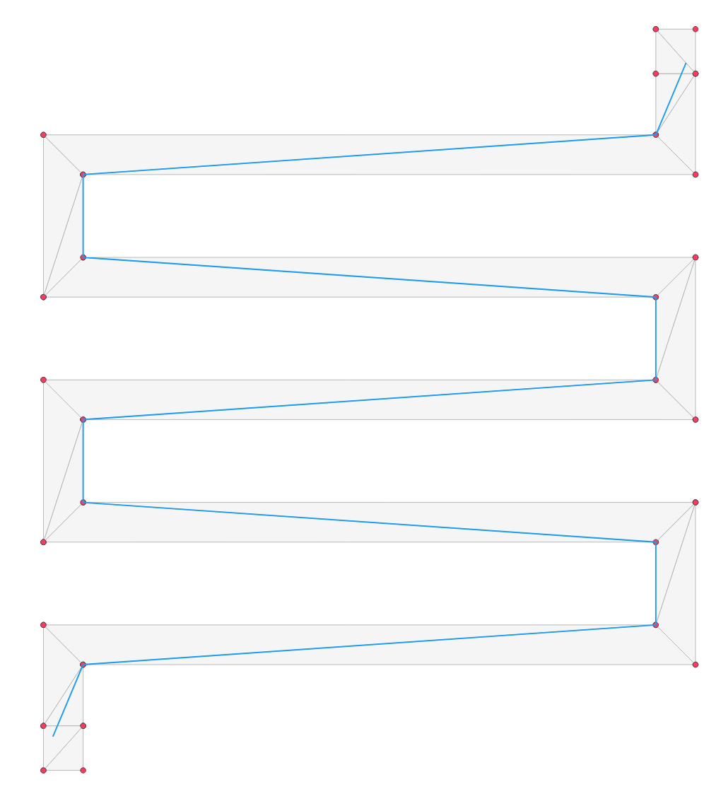
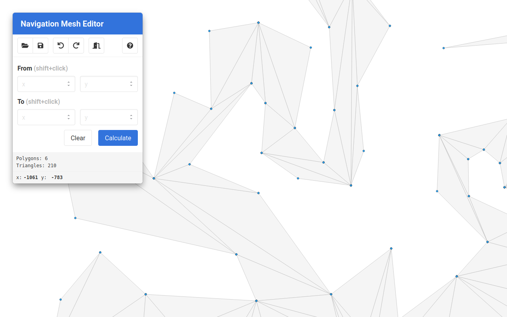
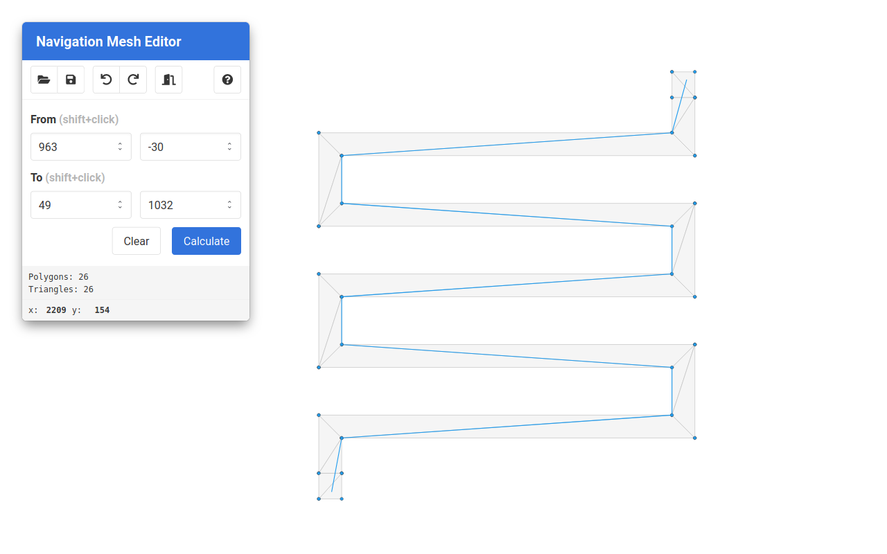
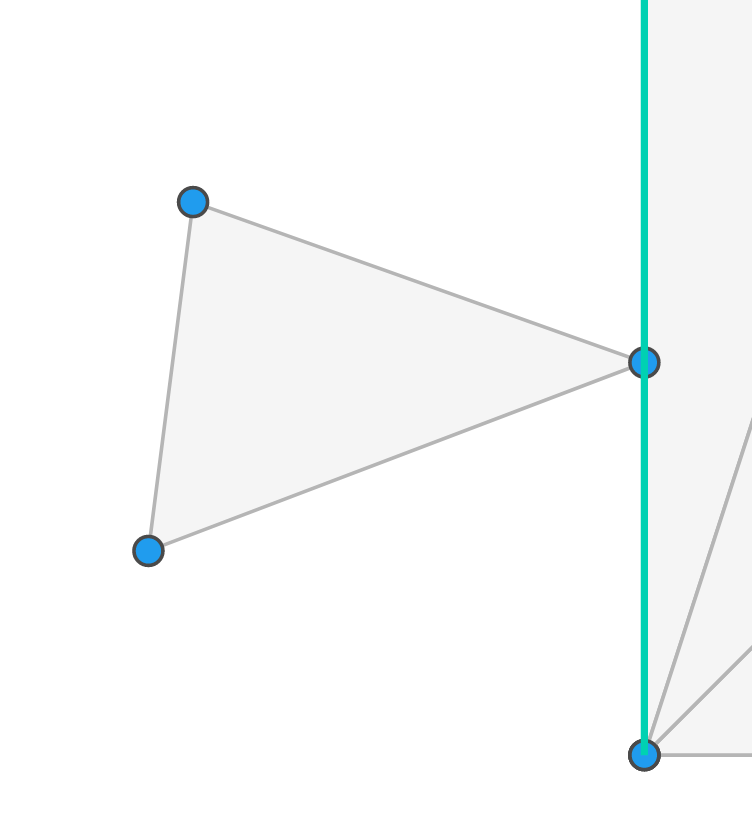

# Nav2d

[](https://badge.fury.io/js/nav2d)
[](https://opensource.org/licenses/MIT)
[](https://bundlephobia.com/result?p=nav2d)

[](https://codecov.io/gh/frapa/nav2d)

This is a high-quality implementation of a 2D polygonal navigation mesh with A\* path finding
and funneling (e.g. finding not only the mesh nodes but also the actual path across polygons).



## Why this package

This package was created due to the lack of generic 2D navigation mesh packages
able to handle polygonal nodes of any shape and integrating a robust funnel algorithm.
Furthermore, some packages require specific file formats for the meshes,
limiting the choices of editors.

This package aims to:

-   Work on node and the browser.
-   Provide robust and fast implementation of a generic polygonal navigation mesh with
    A\* path finding and funneling.
-   Provide a simple user interface:
    -   Accept multiple formats to specify points (for interoperability with other libraries).
    -   Accept any polygon (even convex and defined either in clockwise and counterclockwise
        order) and automatically triangulate.
    -   Automatic neighbor search means that only polygons are needed,
        the relations will be automatically computed (polygon with a shared edges
        are considered neighbors).
    -   All geometric operations and comparisons are tolerant to floating point errors.
    -   Support disconnected navigation meshes.
-   Have good test coverage.

## Install

There are multiple ways to install `nav2d`. If you are using npm,
and building your game with wepback, you can install and use the package
directly:

```bash
$ npm i nav2d
```

You can also directly include the library from the unpkg CDN into your page.
There are two options here,

1. You can use the version containing only the code of this library (you'll have to include all dependencies yourself):

    ```html
    <script defer src="https://unpkg.com/nav2d/dist/nav2d.min.js"></script>
    ```

2. You can use the `deps` bundle, which ships together with all dependencies,
   for hassle free experience:

    ```html
    <script defer src="https://unpkg.com/nav2d/dist/nav2d_deps.min.js"></script>
    ```

## How to use

First create the navigation mesh, by passing an array of polygons,
each polygon being an array of points.
Polygons that are not triangles will be triangulated automatically.

```javascript
import { NavMesh } from "nav2d";

const navmesh = new NavMesh([
    [
        [0, 0],
        [0, 12],
        [12, 0],
    ],
    [
        [12, 8],
        [12, 4],
        [16, 6],
    ],
    [
        [12, 0],
        [6, 6],
        [12, 6],
    ],
    [
        [100, 100],
        [110, 100],
        [100, 110],
        [95, 107],
        [105, 102],
    ],
]);
```

You can pass points as arrays `[x, y]`, as objects `{x:x, y:y}` or
as `Point(x, y)` objects.

> **Warning:** Instantiating the `NavMesh` object can be slow if you have a big mesh with lots
> of polygons, as the constructor has to triangulate the polygons and creates
> a neighbors cache to speed up neighbor lookup when searching. This is a one-time
> cost (e.g. the `NavMesh` class is optimized to be instantiated once and use multiple
> times). Ballpark performance numbers are 1.5 seconds for 1000 polygons and 15 seconds for
> 10_000 polygons (linearly dependent on polygon count).
>
> If your mesh is made up of only triangles, for instance because you use an external triangulation
> algorithm, you can use `new NavMesh(polygons, { triangulate: false })` to skip it, but there
> will still be some cost in caching neighboring triangles. If you disable triangulation on a 
> mesh which isn't made of triangles, the library will return wrong results.
> 
> For games where the mesh is always the same (for instance the map does not change), 
> the best option is to triangulate the navigation mesh when you create the map, load the map
> already triangulated and disable triangulation. This will be the fastest. 

Now we can query paths:

```javascript
const path = navmesh.findPath([1, 1], [14, 6]);
console.log(path); // -> [Point(1, 1), Point(14, 6)]
```

As you can see from the output, thanks to the funnel algorithm, the path will only
contain the necessary path points (in this case a straight line). If no path can be
found (disconnected islands or endpoints outside the mesh) `null` will be returned.

> **Warning:** The path quality heavily depends on the quality of the triangulation.
> If your mesh has a lot of skinny triangles, it might not choose the path you would expect.
>
> `nav2d` automatically triangulates the mesh with [earcut](https://www.npmjs.com/package/earcut), 
> which is fast but sometimes generates non-optimal triangulations. If you have this problem,
> you can try triangulating your mesh manually with a library such as [poly2tri](https://github.com/r3mi/poly2tri.js),
> as [some user successfully did](https://github.com/frapa/nav2d/issues/29).
>
> If you manually triangulate, make sure to disable triangulation using the 
> `new NavMesh(polygons, { triangulate: false })` option to avoid unnecessary work.

To find the path, a optimized A\* implementation is used. You can override the default
the cost and heuristic functions, by passing an `options` object to the `NavMesh` constructor.
For example, to implement a simpler breadth first search, we can do:

```javascript
const costFunc = (polygon1, polygon2, portal) => 1;
const heuristicFunc = () => (polygon, to) => 0;
const navmesh = new NavMesh([...], { costFunc, heuristicFunc });
// Use as before
```

Instead, to implement Dijkstra’s Algorithm, you can:

```javascript
const heuristicFunc = () => (polygon, to) => 0;
const navmesh = new NavMesh(
    [...],
    { heuristicFunc }
);
```

([Look here](https://www.redblobgames.com/pathfinding/a-star/introduction.html)
for an nice explanation of the algorithms above)

The cost function takes two neighboring polygons and a portal as parameters and
returns the cost to go from the first to the second. Both polygons are `Polygon` objects.
The portal is the edge shared between the two polygons.

The heuristic function takes two polygon: a polygon on the path and the final polygon,
and returns an estimation of the distance between the two. Both of these are `Polygon` objects.

> **Note:** The default functions compute the distance between polygons using the
> `.centroidDistance()` method (see below). This computes the Cartesian distance
> between the centroids.

This is basically it. This package does nothing more and nothing less.

## The Editor

For those looking for an easy way to create, view and edit their navigation meshes, `nav2d`
comes with a simple mesh viewer and editor, where you can also test the path finding.

[The editor is accessible here](https://frapa.github.io/nav2d/navmesh_editor/index.html)



The editor lets you load, visualize and edit navigation meshes and then export the result.
It also comes with built-in path finding, so that you can test your routes.



To help while editing, a powerful snapping feature is also included.



## API Reference

#### `Point` or `Vector` (aliases)

> **Note:** In all places where points are accepted, `nav2d` also accepts
> arrays `[x, y]` or `{ x: x, y: y }` objects.

Properties:

-   `x` - X coordinate
-   `y` - Y coordinate

Methods:

-   `Vector(x, y)` - Construct vector or point.
-   `length()` - Vector length.
-   `add(other)` - Add vectors, return new vector.
-   `sub(other)` - Subtract vectors, return new vector.
-   `mul(other)` - Multiply vectors, return new vector.
-   `div(other)` - Divide vectors, return new vector.
-   `equals(other)` - Check for equality.
-   `angle(other)` - Returns angle between vectors.
-   `counterclockwiseAngle(other)` - Return angle between vectors,
    using the current vector as reference (can be negative).

Functions:

-   `dot(a, b)` - Dot product.
-   `cross(a, b)` - Cross product.
-   `isclose(a, b)` - Return true if the given floats are close to each other.
-   `clip(a, b, v)` - Return true if `v` is in the range `a`, `b` range,
    the closest limit of the range otherwise.

#### `Edge`

Properties:

-   `p1` - First edge point.
-   `p2` - Last edge point.

Methods:

-   `Edge(points)` - Construct edge object (like a string between 2 points).
-   `length()` - Edge length.
-   `direction()` - Vector from `p1` to `p2`.
-   `onEdge(ppoint)` - Whether `point` is on the edge.
-   `parallel(otherEdge)` - Whether the two edges are parallel (but might not be on the same line).
-   `collinear(otherEdge)` - Whether the two edges are collinear (parallel and on same line but might not overlap).
-   `overlap(otherEdge)` - Returns overlap between two edges, or null if they do not overlap (might be a null-length edge).
-   `equals(otherEdge)` - Whether the two edges are the same (have the same endpoints, even if reversed).

#### `Polygon`

Properties:

-   `points` - Polygon points.
-   `bounds` - Bounding box array: `[minx, miny, maxx, maxy]`.

Methods:

-   `Polygon(points)` - Construct polygon object.
-   `boundsSize()` - Bounding box array: `[x, y, width, height]`.
-   `edges()` - Edges of the polygon.
-   `centroid()` - Polygon centroid.
-   `centroidDistance(otherPoly)` - Distance from this polygon's centroid to `otherPoly`'s.
-   `contains(point)` - Whether `point` is contained in the polygon.
-   `onEdge(point)` - Whether `point` is on an edge.
-   `touches(edge)` - Whether `edge` touches but doesn't intersect the polygon.

#### `NavMesh`

Properties:

-   `polygons` - Triangulated mesh polygons (triangles).
-   `pointQuerySize` - Square edge size to use to query the `NavMes` quad tree
    when checking for point to mesh intersection. This
    should be much smaller than the average triangle size in
    the mesh, and can freely be set according to your navigation mesh
    scale. Defaults to 0.01.

Methods:

-   `NavMesh(polygons, options?)` - Construct navigation mesh. Arguments:
    - `polygons` - A list of polygons, each polygon being a list of points.
    - `options` - Optional settings. This is the default:
        ```javascript
        {
            // Boolean indicating whether to triangulate mesh or not.
            triangulate: true,
            // Threshold used to check triangle collision.
            // This should be much smaller that the typical
            // size of your mesh triangles too many checks.
            pointQuerySize: 0.01,
            // A cost function (see docs above).
            costFunc: euclideanDistance,
            // An heuristic function (see docs above)
            heuristicFunc: euclideanDistance,
        }
        ```
-   `findPath(from, to)` - Find path from `from` point to `to` point. Returns a list of points, or null if not found.

## Changelog

See [here](./CHANGELOG.md).
