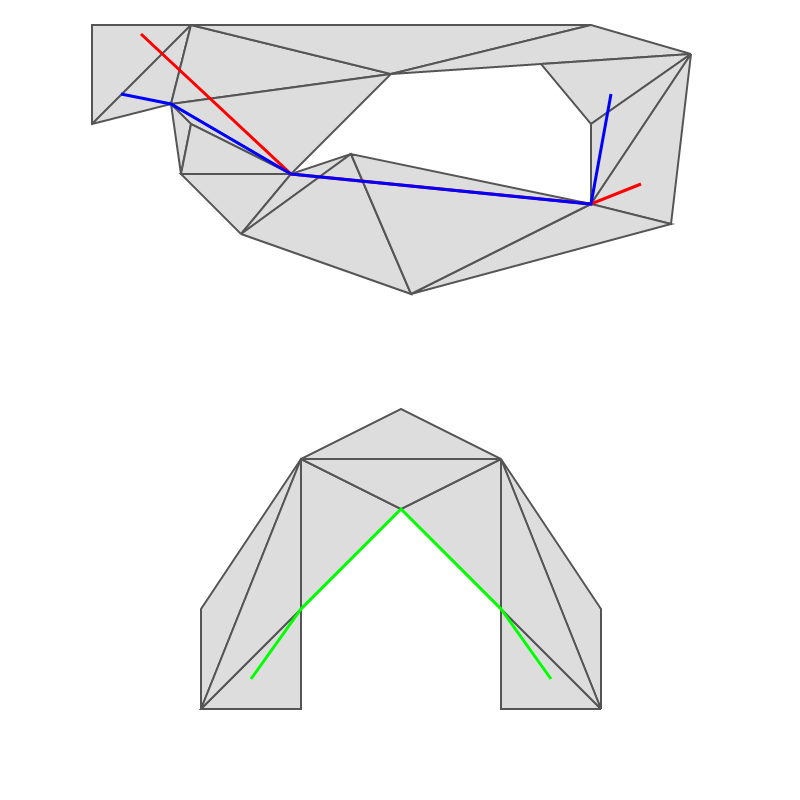

# Nav2d


[](https://opensource.org/licenses/MIT)
[](https://codecov.io/gh/frapa/nav2d)

This is a high-quality implementation of a 2D polygonal navigation mesh with A\* path finding
and funneling (e.g. finding not only the mesh nodes but also the actual path across polygons).



Image: different paths on simple mesh (top) and another path in an automatically triangulated
mesh (bottom).

## Why this package

This package was created due to the lack of generic 2D navigation mesh packages
able to handle polygonal nodes of any shape and integrating a robust funnel algorithm.
Furthermore, some packages require specific file formats for the meshes,
limiting the choices of editors.

This package aims to:

-   Work on node and the browser.
-   Provide robust and fast implementation of a generic polygonal navigation mesh with
    A\* path finding and funneling.
-   Provide a simple user interface:
    -   Accept multiple formats to specify points (for interoperability with other libraries).
    -   Accept any polygon (even convex and defined either in clockwise and counterclockwise
        order) and automatically triangulate.
    -   Automatic neighbor search means that only polygons are needed,
        the relations will be automatically computed (polygon with a shared edges
        are considered neighbors).
    -   All geometric operations and comparisons are tolerant to floating point errors.
    -   Support disconnected navigation meshes.
-   Have good test coverage.

## How to use

First create the navigation mesh, by passing an array of polygons,
each polygon being an array of points.
Polygons that are not triangles will be triangulated automatically.

```javascript
import { NavMesh } from "nav2d";

const navmesh = new NavMesh([
    [
        [0, 0],
        [0, 12],
        [12, 0],
    ],
    [
        [12, 8],
        [12, 4],
        [16, 6],
    ],
    [
        [12, 0],
        [6, 6],
        [12, 6],
    ],
    [
        [100, 100],
        [110, 100],
        [100, 110],
        [95, 107],
        [105, 102],
    ],
]);
```

You can pass points as arrays `[x, y]`, as objects `{x:x, y:y}` or
as `Point(x, y)` objects.

> **Warning:** Instantiating the `NavMesh` object can be slow if you have a big mesh with lots
> of polygons, as the constructor has to triangulate the polygons and creates
> a neighbors cache to speed up neighbor lookup when searching. This is a one-time
> cost (e.g. the `NavMesh` class is optimized to be instantiated once and use multiple
> times). Ballpark performance numbers are 1.5 seconds for 1000 polygons and 15 seconds for
> 10 000 polygons (linearly dependent on polygon count).

Now we can query paths:

```javascript
const path = navmesh.findPath([1, 1], [14, 6]);
console.log(path); // -> [Point(1, 1), Point(14, 6)]
```

As you can see from the output, thanks to the funnel algorithm, the path will only
contain the necessary path points (in this case a straight line). If no path can be
found (disconnected islands or endpoints outside the mesh) `null` will be returned.

This is basically it. This package does nothing more and nothing less.

## Changelog

See [here](./CHANGELOG.md).
